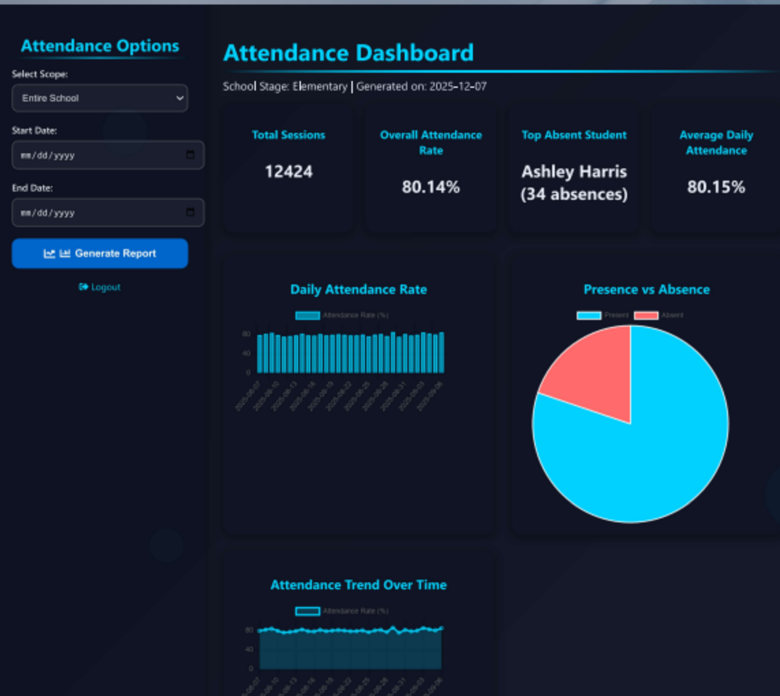
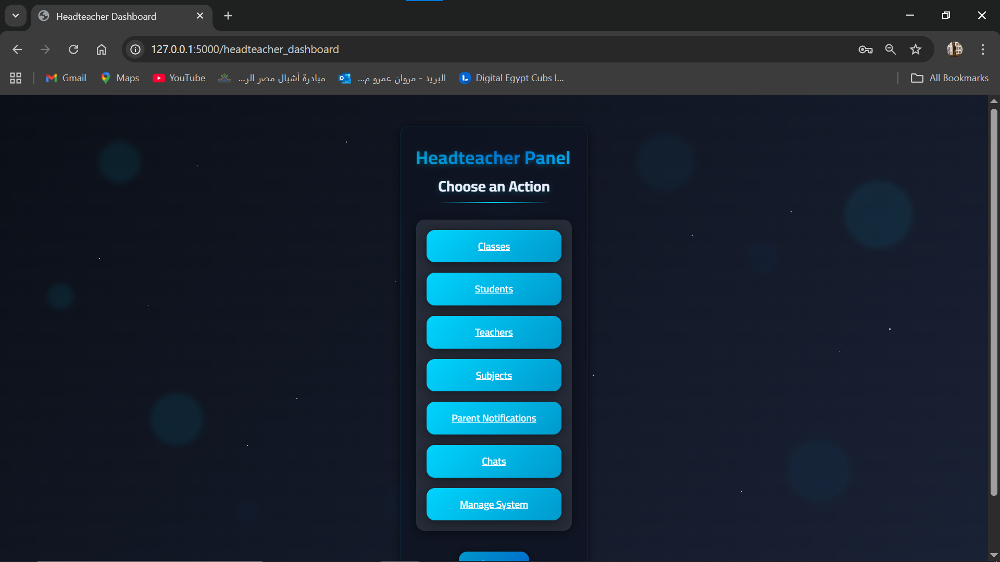
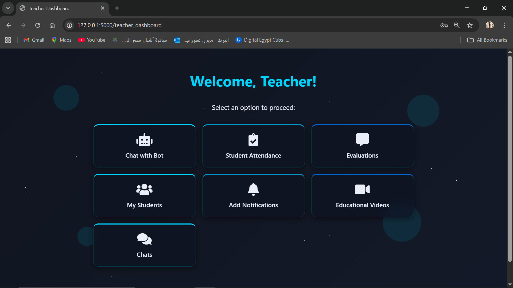
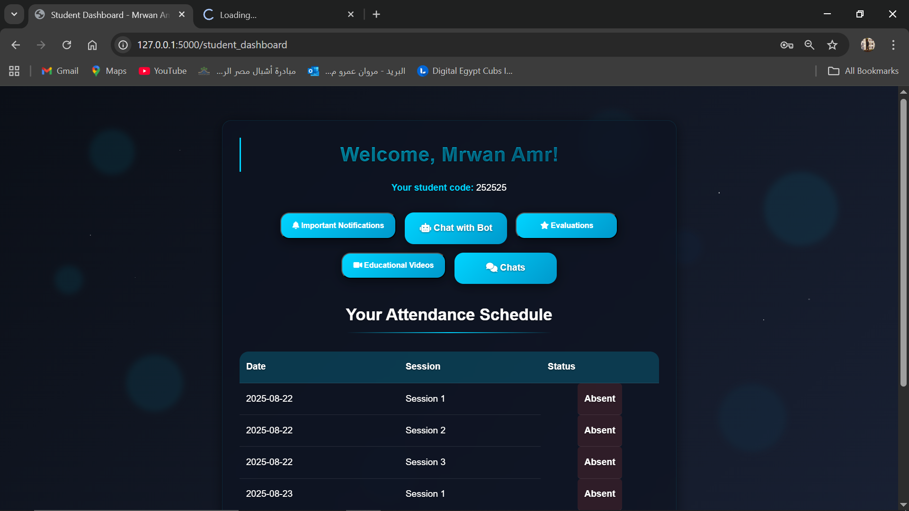
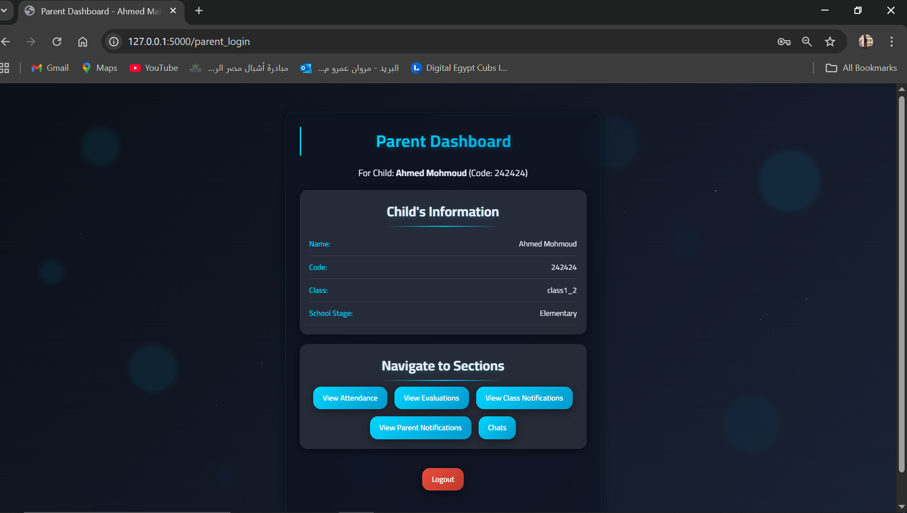
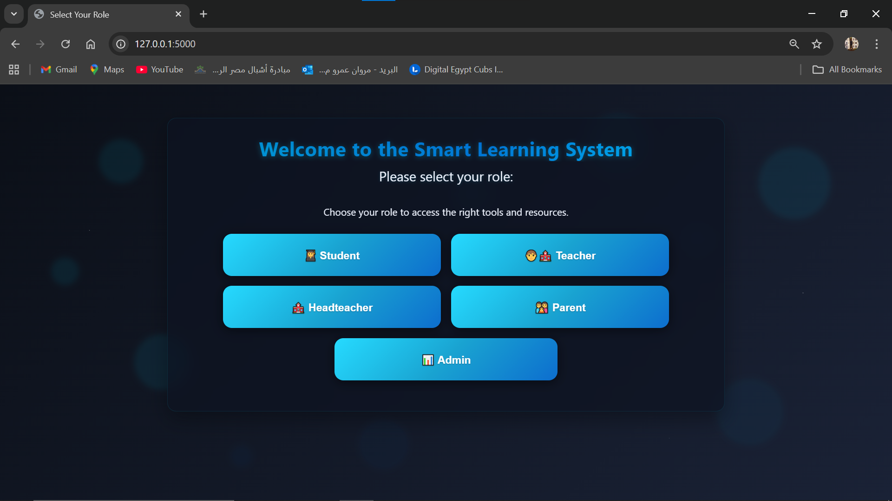

<div align="center">
  
# 🎓 NeuraEdu: AI-Powered Smart Educational Ecosystem
**Bridging the gap between Advanced Computer Vision and Educational Management.**


</div>

## 📌 Project Overview
**NeuraEdu** is a comprehensive, multi-role, AI-driven School Management System. It replaces traditional administrative bottlenecks with real-time automation. The core innovation lies in its **Multiprocessing Architecture**, running a heavy Computer Vision pipeline (YOLOv8 + DeepSort + Face Recognition) for automated attendance, completely synchronized with a robust Flask web backend serving 5 distinct user roles.

---

## 🚀 Core Innovations & Features

### 👁️ 1. Intelligent Vision Pipeline (Automated Attendance)
The system eliminates manual roll calls using a state-of-the-art AI pipeline:
* **Object Detection:** Uses `Ultralytics YOLOv8n` to detect persons in the frame with high confidence, ignoring background noise.
* **Real-time Tracking:** Implements `DeepSort` to assign unique tracking IDs to detected individuals, ensuring students aren't scanned redundantly.
* **Facial Recognition:** Crops detected faces and matches them against pre-encoded datasets using `face_recognition` (dlib).
* **Dynamic Synchronization:** Automatically links recognized faces to the current class schedule and logs attendance into the MySQL database in real-time.

### 👥 2. Five-Tier Role-Based Access Control (RBAC)
A highly secure, session-based routing system tailored for the entire educational hierarchy:
* **📊 Education Admin:** High-level dashboard to monitor overall school performance, attendance rates, and multi-stage database management.
* **🏫 Headteacher:** Full control over school operations. Manages classes, teachers, subjects, broadcasts parent notifications, and controls the AI system state (Start/Stop).
* **🧑‍🏫 Teacher:** Accesses assigned classes, views automated attendance, records student evaluations, uploads educational video links, and communicates with students/parents.
* **👩‍🎓 Student:** Personalized dashboard to track attendance, view academic evaluations, watch subject-specific videos, and read class notifications.
* **👪 Parent:** Dedicated portal to monitor their child's attendance, academic progress, and receive direct administrative notifications.

### 💬 3. Integrated Chat & Communication System
A custom-built, secure messaging engine:
* **Cross-Role Messaging:** Allows direct messaging between Students ↔ Teachers, Parents ↔ Teachers, and Teachers ↔ Headteachers.
* **Contextual Replies:** Supports a `reply_to_message_id` architecture for threaded conversations.
* **Security:** Enforces strict contact validation (e.g., parents can only message teachers assigned to their child's specific class).

### 🛡️ 4. Dynamic & Secure Database Architecture
* **Multi-Tenancy:** Dynamically routes queries to different databases (`schooldata`, `schooldata2`, `schooldata3`) based on the school stage (High, Middle, Elementary).
* **Dynamic Table Generation:** Automatically generates specialized tables for new classes, evaluations, notifications, and videos on the fly.
* **Security First:** Implements `bleach` to sanitize all inputs against XSS attacks, parameterized queries to prevent SQL Injection, and `Flask-Limiter` to prevent brute-force login attempts.

### 🎨 5. "Cinematic" UI/UX Design
* **Aesthetic:** Built with a futuristic, dark-themed **Glassmorphism** design language.
* **Animations:** Features custom CSS3 keyframe animations (floating particles, twinkling stars, typewriter effects) for a highly interactive and immersive user experience.
* **Data Visualization:** Utilizes `Chart.js` for beautiful, responsive pie and bar charts in the administrative dashboards.

---

## 🛠️ Technology Stack

| Domain | Technologies Used |
| :--- | :--- |
| **Backend Framework** | Python, Flask, Flask-WTF, Flask-Limiter, Multiprocessing |
| **Database** | MySQL, `mysql-connector-python` |
| **Computer Vision / AI** | OpenCV, YOLOv8 (Ultralytics), DeepSort, `face_recognition`, Numpy |
| **Frontend** | HTML5, Advanced CSS3, JavaScript, Chart.js |
| **Security** | Bleach (Sanitization), Session Management, Password Hashing |

---

## 📸 System Previews

> **Note:** Screenshots highlighting the Glassmorphism UI and the YOLOv8 Detection window.

| Admin Analytics Dashboard | AI Camera Detection in Action |
| :---: |
|  
 
 
 
 |  |

---

## 💻 Installation & Setup

### Prerequisites
1. Python 3.8+ installed.
2. MySQL Server (e.g., XAMPP/WAMP) running locally.
3. A functional Webcam.

### Step-by-Step Guide
1. **Clone the repository:**
   ```bash
   git clone [https://github.com/mrwanamr65/NeuraEdu.git](https://github.com/mrwanamr65/NeuraEdu.git)
   cd NeuraEdu
